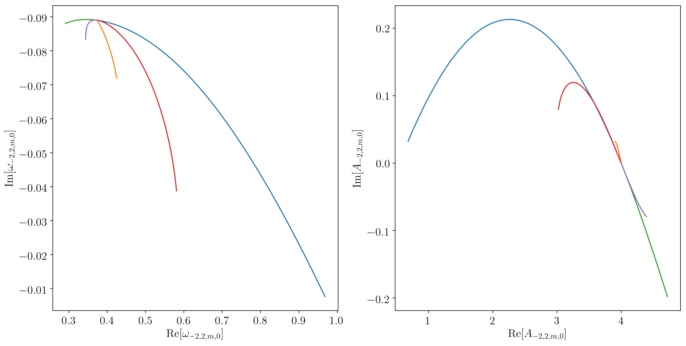

[](https://github.com/duetosymmetry/qnm)
[](https://badge.fury.io/py/qnm)
[](https://zenodo.org/record/2593978)
[](https://joss.theoj.org/papers/85532a74baaa67a24518de1365f1bcf5)
[](https://arxiv.org/abs/1908.10377)
[](http://ascl.net/1910.022)
[](https://github.com/duetosymmetry/qnm/blob/master/LICENSE)
[](https://travis-ci.org/duetosymmetry/qnm)
[](https://qnm.readthedocs.io/en/latest/?badge=latest)


# Welcome to qnm
`qnm` is an open-source Python package for computing the Kerr
quasinormal mode frequencies, angular separation constants, and
spherical-spheroidal mixing coefficients. The `qnm` package includes a
Leaver solver with the [Cook-Zalutskiy spectral
approach](https://arxiv.org/abs/1410.7698) to the angular sector, and
a caching mechanism to avoid repeating calculations.

With this python package, you can compute the QNMs labeled by
different (s,l,m,n), at a desired dimensionless spin parameter 0≤a<1.
The angular sector is treated as a spectral decomposition of
spin-weighted *spheroidal* harmonics into spin-weighted spherical
harmonics.  Therefore you get the spherical-spheroidal decomposition
coefficients for free when solving for ω and A ([see below for
details](#spherical-spheroidal-decomposition)).

We have precomputed a large cache of low-lying modes (s=-2 and s=-1,
all l<8, all n<7). These can be automatically installed with a single
function call, and interpolated for good initial guesses for
root-finding at some value of a.

## Installation

### PyPI
_**qnm**_ is available through [PyPI](https://pypi.org/project/qnm/):

```shell
pip install qnm
```

### From source

```shell
git clone https://github.com/duetosymmetry/qnm.git
cd qnm
python setup.py install
```

If you do not have root permissions, replace the last step with
`python setup.py install --user`.  Instead of using `setup.py`
manually, you can also replace the last step with `pip install .` or
`pip install --user .`.

## Dependencies
All of these can be installed through pip or conda.
* [numpy](https://docs.scipy.org/doc/numpy/user/install.html)
* [scipy](https://www.scipy.org/install.html)
* [numba](http://numba.pydata.org/numba-doc/latest/user/installing.html)
* [tqdm](https://tqdm.github.io) (just for `qnm.download_data()` progress)
* [pathlib2](https://pypi.org/project/pathlib2/) (backport of
  `pathlib` to pre-3.4 python)

## Documentation

Automatically-generated API documentation is available on [Read the Docs: qnm](https://qnm.readthedocs.io/).


## Usage

The highest-level interface is via `qnm.cached.KerrSeqCache`, which
loads cached *spin sequences* from disk. A spin sequence is just a mode
labeled by (s,l,m,n), with the spin a ranging from a=0 to some
maximum, e.g. 0.9995. A large number of low-lying spin sequences have
been precomputed and are available online. The first time you use the
package, download the precomputed sequences:

```python
import qnm

qnm.download_data() # Only need to do this once
# Trying to fetch https://duetosymmetry.com/files/qnm/data.tar.bz2
# Trying to decompress file /<something>/qnm/data.tar.bz2
# Data directory /<something>/qnm/data contains 860 pickle files
```

Then, use `qnm.modes_cache` to load a
`qnm.spinsequence.KerrSpinSeq` of interest. If the mode is not
available, it will try to compute it (see detailed documentation for
how to control that calculation).

```python
grav_220 = qnm.modes_cache(s=-2,l=2,m=2,n=0)
omega, A, C = grav_220(a=0.68)
print(omega)
# (0.5239751042900845-0.08151262363119974j)
```

Calling a spin sequence `seq` with `seq(a)` will return the complex
quasinormal mode frequency omega, the complex angular separation
constant A, and a vector C of coefficients for decomposing the
associated spin-weighted spheroidal harmonics as a sum of
spin-weighted spherical harmonics ([see below for
details](#spherical-spheroidal-decomposition)).

Visual inspections of modes are very useful to check if the solver is
behaving well. This is easily accomplished with matplotlib. Here are
some partial examples (for the full examples, see the file
[`notebooks/examples.ipynb`](notebooks/examples.ipynb) in the source repo):

```python
import numpy as np
import matplotlib as mpl
import matplotlib.pyplot as plt

s, l, m = (-2, 2, 2)
mode_list = [(s, l, m, n) for n in np.arange(0,7)]
modes = { ind : qnm.modes_cache(*ind) for ind in mode_list }

plt.subplot(1, 2, 1)
for mode, seq in modes.items():
    plt.plot(np.real(seq.omega),np.imag(seq.omega))

plt.subplot(1, 2, 2)
for mode, seq in modes.items():
    plt.plot(np.real(seq.A),np.imag(seq.A))
```

Which results in the following figure (modulo formatting):


```python
s, l, n = (-2, 2, 0)
mode_list = [(s, l, m, n) for m in np.arange(-l,l+1)]
modes = { ind : qnm.modes_cache(*ind) for ind in mode_list }

plt.subplot(1, 2, 1)
for mode, seq in modes.items():
    plt.plot(np.real(seq.omega),np.imag(seq.omega))

plt.subplot(1, 2, 2)
for mode, seq in modes.items():
    plt.plot(np.real(seq.A),np.imag(seq.A))
```

Which results in the following figure (modulo formatting):



## Precision and validation

The default tolerances for continued fractions, `cf_tol`, is 1e-10, and
for complex root-polishing, `tol`, is DBL_EPSILON≅1.5e-8.  These can
be changed at runtime so you can re-polish the cached values to higher
precision.

[Greg Cook's precomputed data
tables](https://zenodo.org/record/2650358) (which were computed with
arbitrary-precision arithmetic) can be used for validating the results
of this code.  See the comparison notebook
[`notebooks/Comparison-against-Cook-data.ipynb`](notebooks/Comparison-against-Cook-data.ipynb)
to see such a comparison, which can be modified to compare any of the
available modes.

## Spherical-spheroidal decomposition

The angular dependence of QNMs are naturally spin-weighted *spheroidal*
harmonics.  The spheroidals are not actually a complete orthogonal
basis set.  Meanwhile spin-weighted *spherical* harmonics are complete
and orthonormal, and are used much more commonly.  Therefore you
typically want to express a spheroidal (on the left hand side) in
terms of sphericals (on the right hand side),


Here ℓmin=max(|m|,|s|) and ℓmax can be chosen at run time.  The C
coefficients are returned as a complex ndarray, with the zeroth
element corresponding to ℓmin.
To avoid indexing errors, you can get the ndarray of ℓ values by
calling `qnm.angular.ells`, e.g.

```
ells = qnm.angular.ells(s=-2, m=2, l_max=grav_220.l_max)
```

## Contributing
Contributions are welcome! There are at least two ways to contribute to this codebase:

1. If you find a bug or want to suggest an enhancement, use the [issue tracker](https://github.com/duetosymmetry/qnm/issues) on GitHub. It's a good idea to look through past issues, too, to see if anybody has run into the same problem or made the same suggestion before.
2. If you will write or edit the python code, we use the [fork and pull request](https://help.github.com/articles/creating-a-pull-request-from-a-fork/) model.

You are also allowed to make use of this code for other purposes, as detailed in the [MIT license](LICENSE). For any type of contribution, please follow the [code of conduct](CODE_OF_CONDUCT.md).

## How to cite
If this package contributes to a project that leads to a publication,
please acknowledge this by citing the `qnm` article in JOSS.  The
following BibTeX entry is available in the `qnm.__bibtex__` string:
```
@article{Stein:2019mop,
      author         = "Stein, Leo C.",
      title          = "{qnm: A Python package for calculating Kerr quasinormal
                        modes, separation constants, and spherical-spheroidal
                        mixing coefficients}",
      journal        = "J. Open Source Softw.",
      volume         = "4",
      year           = "2019",
      number         = "42",
      pages          = "1683",
      doi            = "10.21105/joss.01683",
      eprint         = "1908.10377",
      archivePrefix  = "arXiv",
      primaryClass   = "gr-qc",
      SLACcitation   = "%%CITATION = ARXIV:1908.10377;%%"
}
```

## Credits
The code is developed and maintained by [Leo C. Stein](https://duetosymmetry.com).
